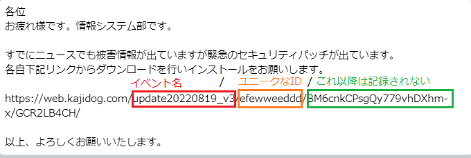

# SpoofingTool

なりすましメール訓練ツール

## 目次

1. MailingTool  
 1.1. 使用言語  
 1.2. 開発  
 1.2.1 インストール  
 1.2.2 dev server 起動  
 1.2.3 ビルド  
 1.3. アプリ操作  
2. spoofing_website  
2.1. 使用言語  
2.2. 開発  
2.2.1 dev server 起動  
2.2.2 ビルド  
2.3 仕様  
2.3.1 リンク  
2.3.2 訓練用ページ  

## 1. MailingTool

メール送信ツール

### 1.1. 使用言語

Node.js v18.7.0  
Electron 19.0.4  
TypeScript 4.7.3  
svelte 3.49.0  


### 1.2. 開発

最初にMailingToolのディレクトリに移動

 ```bash
    cd MailingTool
 ```

#### 1.2.1 インストール

 ```bash
    npm i
 ```

#### 1.2.2 dev server 起動

 ```bash
    npm run dev
 ```

#### 1.2.3 ビルド

 *out* にインストーラーが生成されます。  

 ```bash
    npm run out:win
 ```

### 1.3. アプリ操作

必要な情報を入力し、*メール送信ボタン* からメールを送信できます。  
csvの形式は ***sample.csv*** を参考にしてください。(メールアドレスの列は必須)  

本文の中に <#列名> でメールごとに違う内容にすることができます。  
例）  

## 2. spoofing_website

アクセスしたユーザーを記録するツール

http://localhost:3000/イベント名/アクセスしたユーザー/・・・/・・・  
で記録してます。  
アクセスログは以下の内容で記録されます。  
log/イベント名/アクセスしたユーザー.txt  

### 2.1. 使用言語

Node.js v18.7.0  
TypeScript 4.7.4  
Next.js 12.2.5  

### 2.2. 開発

最初にspoofing_websiteのディレクトリに移動

 ```bash
    cd spoofing_website
 ```

#### 2.2.1 dev server 起動

 ```bash
    npm run dev
 ```

#### 2.2.2 ビルド

 ```bash
    npm run build
    npm run start
 ```

### 2.3 仕様

#### 2.3.1 リンク

  

https://web.kajidog.com/update20220819_v3/efewweeddd/BM6cnkCPsgQy779vhDXhm-x/GCR2LB4CH/  
上記リンクを踏んだ場合、*update20220819_v3* というフォルダの中の *efewweeddd.txt* にアクセスした時間が記録されます。

#### 2.3.2 訓練用ページ

  

**spoofing_website/pages/[name]/[id]/\[\[...other]]/index.tsx**  
上記のファイルがなりすまし訓練用のページになります。  

画像を追加したい場合は *public* のフォルダに配置で使用できるようになります。
